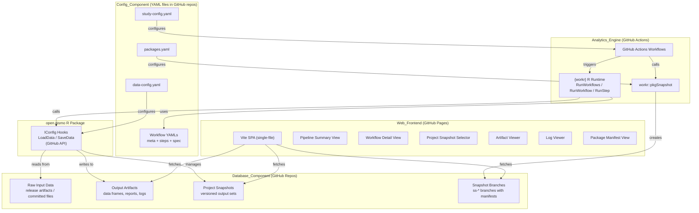
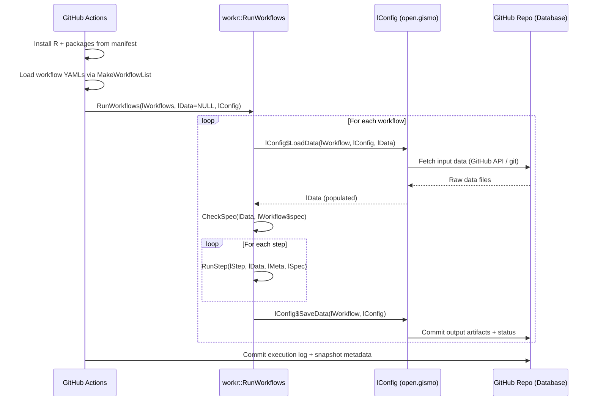
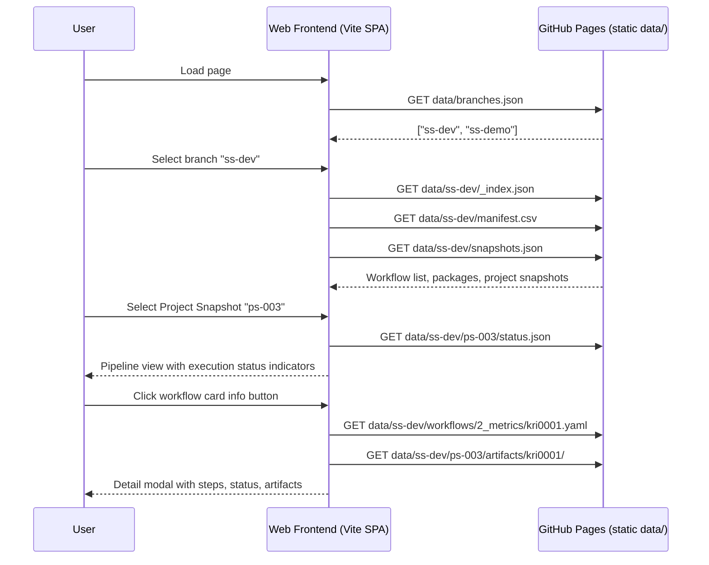

# Design Document: open.gismo Platform

## Overview

open.gismo is a thin integration layer that connects four modular components — Database, Analytics Engine, Web Front-end, and Config — into an end-to-end analytics platform powered by {workr}. The default implementation uses GitHub as the backbone for all four components: repos/releases for storage, Actions for compute, Pages for the front-end, and YAML files in repos for configuration.

The core design principle is **do not recreate {workr} functionality**. open.gismo provides:

1. **GitHub-specific lConfig hooks** (R functions) — the `LoadData`/`SaveData` implementations that let `workr::RunWorkflow` read from and write to GitHub repos. This is the only new R code.
2. **Project Snapshot management** — a convention for organizing versioned pipeline outputs (data frames, reports, logs, execution status) on GitHub branches, layered on top of {workr}'s existing Package Snapshot system.
3. **Enhanced Web Front-end** — the existing `workr/site/` Vite app migrated into `open.gismo/site/` and extended with Project Snapshot selection, per-step execution status, artifact viewing, and log viewing.
4. **GitHub Actions** — new reusable workflows that orchestrate pipeline execution using `workr::RunWorkflows` with the GitHub lConfig hooks, manage Project Snapshots, and build/deploy the enhanced front-end.
5. **AGENTS.md and AI Skills** — development documentation for agents and humans.

### What lives where

| Artifact | Location | Rationale |
|---|---|---|
| GitHub lConfig hooks (R) | `open.gismo` repo, `R/` directory | New R code, not part of {workr} core |
| Project Snapshot conventions | `open.gismo` repo, documented in AGENTS.md | New concept layered on {workr} snapshots |
| Enhanced front-end | `open.gismo` repo, `site/` directory | Migrated from `workr/site/`, extended |
| GitHub Actions for pipelines | `open.gismo` repo, `.github/workflows/` | New Actions calling {workr} functions |
| Example projects | `open.gismo` repo, `inst/examples/` | Demo data and configs |
| AGENTS.md + AI Skills | `open.gismo` repo root + `skills/` | Platform-level docs |
| {workr} `open.gismo` branch | `workr` repo, `open.gismo` branch | Minimal changes if needed (e.g., new exports) |

### Key {workr} functions used directly (not recreated)

- `workr::RunWorkflow(lWorkflow, lData, lConfig)` — core execution with lConfig hooks
- `workr::RunWorkflows(lWorkflows, lData, lConfig)` — multi-workflow chaining
- `workr::RunStep(lStep, lData, lMeta, lSpec)` — individual step execution
- `workr::MakeWorkflowList(strNames, strPath, strPackage)` — YAML loading and validation
- `workr::RunQuery(strQuery, df)` — SQL on data frames via DuckDB
- `workr::pkgSnapshot(path, packageList, date, branch)` — reproducible package snapshots
- Internal helpers: `CheckSpec()`, `LogMessage()`, `GetStrFunctionIfNamespaced()`

## Architecture

### High-Level Component Diagram



### Data Flow: Pipeline Execution



### Data Flow: Front-end




## Components and Interfaces

### Component 1: Database_Component — GitHub lConfig Hooks (R Package)

This is the only new R code in open.gismo. It implements the `lConfig` interface that {workr}'s `RunWorkflow` already supports.

#### R Package Structure

```
open.gismo/
├── DESCRIPTION
├── NAMESPACE
├── R/
│   ├── gh_lConfig.R        # Factory: gh_lConfig(repo, branch, token, ...)
│   ├── gh_LoadData.R        # lConfig$LoadData implementation
│   ├── gh_SaveData.R        # lConfig$SaveData implementation
│   ├── gh_api.R             # Low-level GitHub API helpers (GET/PUT content)
│   ├── snapshot_manager.R   # Project Snapshot CRUD operations
│   └── status_tracker.R     # Per-step execution status recording
├── inst/
│   ├── examples/            # Example projects with demo data
│   └── workflows/           # Any open.gismo-specific workflow YAMLs
├── tests/
│   └── testthat/
├── site/                    # Enhanced Vite front-end (migrated from workr/site)
├── .github/
│   └── workflows/           # GitHub Actions for open.gismo
├── skills/                  # AI Skills markdown files
└── AGENTS.md
```

#### Interface: `gh_lConfig()` Factory

```r
#' Create a GitHub-backed lConfig object for workr::RunWorkflow
#'
#' @param repo Character. GitHub repo in "owner/repo" format.
#' @param branch Character. Branch for reading/writing data. Default: "main".
#' @param snapshot_id Character. Project Snapshot identifier (e.g., "ps-003").
#' @param data_config List. Parsed data-config.yaml mapping domains to paths.
#' @param token Character. GitHub PAT. Default: Sys.getenv("GITHUB_TOKEN").
#'
#' @return List with LoadData and SaveData functions conforming to workr lConfig interface.
gh_lConfig <- function(
  repo,
  branch = "main",
  snapshot_id = NULL,
  data_config = list(),
  token = Sys.getenv("GITHUB_TOKEN")
) {
  list(
    repo = repo,
    branch = branch,
    snapshot_id = snapshot_id,
    data_config = data_config,
    token = token,
    LoadData = gh_LoadData,
    SaveData = gh_SaveData
  )
}
```

#### Interface: `gh_LoadData(lWorkflow, lConfig, lData)`

Signature matches what `workr::RunWorkflow` expects (validated in RunWorkflow.R lines 68-78).

**Behavior:**
1. Read `lWorkflow$spec` to determine which data domains are needed.
2. For each domain in the spec, look up the storage path in `lConfig$data_config`.
3. Fetch the file from GitHub (via API or raw URL) for the current `lConfig$snapshot_id`.
4. If the domain is not found in the current snapshot, check previous snapshots (inheritance).
5. Parse the file (CSV → data.frame) and add to `lData`.
6. Return the populated `lData`.

**Error handling:** If GitHub API returns an error, log with `workr:::LogMessage(level="error", ...)` including repo path and HTTP status. Return `lData` with available domains.

#### Interface: `gh_SaveData(lWorkflow, lConfig)`

Signature matches what `workr::RunWorkflow` expects (validated in RunWorkflow.R lines 131-143).

**Behavior:**
1. Extract `lWorkflow$lResult` and `lWorkflow$lData` (output artifacts).
2. Determine the output path from `lConfig$data_config` and `lConfig$snapshot_id`.
3. Serialize data frames to CSV, reports to their native format.
4. Commit files to the GitHub repo via the Contents API (PUT).
5. Record execution status (completed/failed) for each step in `status.json`.

**Error handling:** If GitHub API returns an error, log with repo path and HTTP status. Retain data in `lWorkflow$lResult` for retry.

#### Interface: Project Snapshot Manager

```r
#' Create a new Project Snapshot
#' @param repo Character. GitHub repo "owner/repo".
#' @param branch Character. Snapshot branch.
#' @param input_data_version Character. Description of input data version.
#' @param package_snapshot Character. Package snapshot branch used (e.g., "ss-dev").
#' @param token Character. GitHub PAT.
#' @return Character. The new snapshot_id (e.g., "ps-004").
create_project_snapshot <- function(repo, branch, input_data_version, package_snapshot, token)

#' List all Project Snapshots for a branch
#' @return Data frame with columns: snapshot_id, created_at, input_data_version, package_snapshot.
list_project_snapshots <- function(repo, branch, token)

#' Get execution status for a Project Snapshot
#' @return List of workflow statuses with per-step status (completed/failed/not_run).
get_snapshot_status <- function(repo, branch, snapshot_id, token)
```

#### Data Storage Convention on GitHub

```
repo (e.g., my-org/my-study)/
├── main branch (or any working branch)
│   ├── config/
│   │   ├── packages.yaml
│   │   ├── data-config.yaml
│   │   └── study-config.yaml
│   ├── workflow/
│   │   ├── 1_mappings/*.yaml
│   │   ├── 2_metrics/*.yaml
│   │   └── 3_reporting/*.yaml
│   └── modules/
│       └── <module_name>/
│           ├── config.yaml
│           ├── steps.yaml
│           └── spec.yaml
│
├── ss-dev branch (Package Snapshot — created by workr::pkgSnapshot)
│   ├── manifest.csv
│   ├── rproject.toml
│   ├── packages.yaml
│   └── workflows/
│       ├── 1_mappings/*.yaml
│       └── ...
│
└── data branch (Project Snapshots — managed by open.gismo)
    ├── snapshots.json              # Index of all project snapshots
    ├── ps-001/                     # Project Snapshot 1
    │   ├── metadata.json           # {snapshot_id, created_at, input_data_version, package_snapshot}
    │   ├── status.json             # Per-workflow, per-step execution status
    │   ├── log.json                # Execution logs (stdout, stderr, timing)
    │   ├── input/                  # Input data files (CSV)
    │   │   ├── Raw_AE.csv
    │   │   └── ...
    │   └── output/                 # Output artifacts organized by phase
    │       ├── 1_mappings/
    │       │   ├── AE/
    │       │   │   └── Mapped_AE.csv
    │       │   └── ...
    │       ├── 2_metrics/
    │       │   ├── kri0001/
    │       │   │   ├── Analysis_Input.csv
    │       │   │   └── Analysis_Summary.csv
    │       │   └── ...
    │       └── 3_reporting/
    │           ├── Results.csv
    │           └── ...
    ├── ps-002/                     # Project Snapshot 2 (inherits from ps-001)
    │   ├── metadata.json
    │   ├── status.json
    │   ├── log.json
    │   ├── input/                  # Only new/changed input data
    │   │   └── Raw_AE.csv         # Updated AE data
    │   └── output/
    │       └── ...
    └── ...
```

### Component 2: Analytics Engine — GitHub Actions

These are new reusable GitHub Actions workflows in the `open.gismo` repo. They call existing {workr} functions.

#### Action: `run-pipeline.yaml`

Reusable workflow that executes a full {workr} pipeline within a Project Snapshot.

```yaml
# Inputs:
#   repo: GitHub repo (owner/repo)
#   snapshot_branch: ss-* branch with package manifest
#   snapshot_id: Project Snapshot ID (or "new" to create one)
#   input_data_version: Description of input data version (for new snapshots)
#
# Steps:
#   1. Checkout repo
#   2. Install R + packages from manifest.csv on snapshot_branch
#   3. Source open.gismo R functions
#   4. Create or load Project Snapshot
#   5. Build lConfig via gh_lConfig()
#   6. Load workflows via workr::MakeWorkflowList()
#   7. Execute via workr::RunWorkflows(lWorkflows, lData=NULL, lConfig)
#   8. Commit status.json + log.json + output artifacts
```

#### Action: `create-snapshot.yaml`

Creates a new Project Snapshot with input data.

```yaml
# Inputs:
#   repo: GitHub repo
#   data_branch: Branch to store project snapshots
#   input_data_version: Version label
#   package_snapshot: ss-* branch to reference
#
# Steps:
#   1. Checkout repo
#   2. Call create_project_snapshot() to allocate next ps-NNN ID
#   3. Upload input data files to ps-NNN/input/
#   4. Commit snapshots.json update
```

#### Action: `build-site.yaml`

Deployment workflow for publishing the already-built `demo` branch to GitHub Pages.

```yaml
# Steps:
#   1. Checkout the demo branch explicitly
#   2. Validate the required static site artifacts at the branch root
#   3. Upload the demo branch root via the GitHub Pages artifact API
#   4. Deploy that artifact to GitHub Pages
```

### Component 3: Web Front-end — Enhanced Vite SPA

Migrated from `workr/site/` into `open.gismo/site/`. All existing modules are preserved and extended.

#### Migrated Modules (from workr/site/src/)

| Module | Status | Changes |
|---|---|---|
| `constants.js` | Migrated as-is | PHASES array unchanged |
| `utils.js` | Migrated as-is | `esc()` helper unchanged |
| `parsers.js` | Migrated as-is | `parseYamlMeta()`, `parseWorkflow()`, `parseCsv()` unchanged |
| `data.js` | Extended | Add `loadSnapshots()`, `loadSnapshotStatus()`, `loadArtifact()`, `loadLog()` |
| `pipeline.js` | Extended | Add execution status indicators to cards |
| `detail.js` | Extended | Add status badges, artifact links, log section |
| `packages.js` | Migrated as-is | `buildPackagesTable()`, `loadPackages()` unchanged |
| `filters.js` | Migrated as-is | `setFilter()`, `applyFilters()`, `resetFilters()` unchanged |
| `main.js` | Extended | Add Project Snapshot selector, artifact viewer, log viewer |

#### New Modules

| Module | Purpose |
|---|---|
| `snapshots.js` | `buildSnapshotSelector()`, `onSnapshotChange()` — Project Snapshot dropdown and loading |
| `status.js` | `buildStatusBadge()`, `buildStatusSummary()` — status indicators (completed/failed/not_run) |
| `artifacts.js` | `buildArtifactViewer()`, `buildDataTable()` — input/output artifact display with preview |
| `logs.js` | `buildLogViewer()`, `buildLogEntry()` — execution log display with stdout/stderr styling |

#### New Data Fetching Functions (added to `data.js`)

```javascript
// Fetch list of project snapshots for a branch
export async function loadSnapshots(branch) {
  const res = await fetch(`data/${branch}/snapshots.json`);
  if (!res.ok) throw new Error('No snapshots data');
  return res.json(); // [{snapshot_id, created_at, input_data_version, package_snapshot}]
}

// Fetch execution status for a specific project snapshot
export async function loadSnapshotStatus(branch, snapshotId) {
  const res = await fetch(`data/${branch}/${snapshotId}/status.json`);
  if (!res.ok) throw new Error('No status data');
  return res.json(); // {workflows: {wf_id: {steps: [{name, status, error}]}}}
}

// Fetch an artifact file (CSV data)
export async function loadArtifact(branch, snapshotId, artifactPath) {
  const res = await fetch(`data/${branch}/${snapshotId}/output/${artifactPath}`);
  if (!res.ok) throw new Error(`Could not load artifact: ${artifactPath}`);
  return res.text();
}

// Fetch execution log for a workflow or step
export async function loadLog(branch, snapshotId) {
  const res = await fetch(`data/${branch}/${snapshotId}/log.json`);
  if (!res.ok) throw new Error('No log data');
  return res.json();
}
```

#### Status Indicator Design

Three states with distinct visual treatment:

| Status | Icon | Color | CSS Class |
|---|---|---|---|
| `completed` | ✓ checkmark | Green `#22c55e` | `.status-completed` |
| `failed` | ✗ cross | Red `#ef4444` | `.status-failed` |
| `not_run` | ○ circle | Gray `#9ca3b8` | `.status-not-run` |

### Component 4: Config_Component

No new code needed — this uses existing {workr} YAML conventions and the project config structure already demonstrated in `beta1-study-S0001/`. The Config_Component is purely a set of conventions for file organization.

#### Required Config Files

| File | Purpose | Example |
|---|---|---|
| `config/packages.yaml` | List of R package refs for `pkgSnapshot` | `packages: ["org/pkg@v1.0"]` |
| `config/data-config.yaml` | Maps data domains to storage paths | See beta1 example |
| `config/study-config.yaml` | Project metadata + workflow image list | See beta1 example |
| `workflow/` | Phase-organized workflow YAMLs | `1_mappings/`, `2_metrics/`, etc. |
| `modules/` | Output module configs | `config.yaml`, `steps.yaml`, `spec.yaml` per module |

### Interface Contracts Between Components

#### Contract 1: Analytics Engine ↔ Database (lConfig interface)

```
LoadData(lWorkflow, lConfig, lData) → lData
  - lWorkflow: list with $meta, $spec, $steps
  - lConfig: list with $repo, $branch, $snapshot_id, $data_config, $token
  - lData: list of data.frames (may be NULL or partially populated)
  - Returns: lData with additional data.frames loaded per lWorkflow$spec

SaveData(lWorkflow, lConfig) → side effect (commits to GitHub)
  - lWorkflow: list with $meta, $lResult, $lData
  - lConfig: same as above
  - Side effect: commits output files + updates status.json
```

#### Contract 2: Analytics Engine ↔ Config (YAML files)

```
workr::MakeWorkflowList(strPath="workflow") → list of workflow objects
  - Each workflow has: $meta (Type, ID, Priority), $steps, $spec (optional)
  - Workflows sorted by $meta$Priority
  - File names should match $meta$ID
```

#### Contract 3: Web Front-end ↔ Database (static files)

```
data/branches.json → ["ss-dev", "ss-demo"]
data/{branch}/_index.json → ["workflows/1_mappings/AE.yaml", ...]
data/{branch}/manifest.csv → CSV with org, package, version, repository, url, sha
data/{branch}/_snapshot_date.txt → "2025-01-15"
data/{branch}/snapshots.json → [{snapshot_id, created_at, input_data_version, package_snapshot}]
data/{branch}/{snapshot_id}/status.json → {workflows: {wf_id: {status, steps: [{name, status, error}]}}}
data/{branch}/{snapshot_id}/log.json → {workflows: {wf_id: {stdout, stderr, start, end, duration, steps: [...]}}}
data/{branch}/{snapshot_id}/output/{phase}/{wf_id}/{artifact}.csv → CSV data
```


## Data Models

### Project Snapshot Index (`snapshots.json`)

```json
{
  "project_id": "my-study",
  "snapshots": [
    {
      "snapshot_id": "ps-001",
      "created_at": "2025-01-15T10:30:00Z",
      "input_data_version": "2025-Q1 data cut",
      "package_snapshot": "ss-dev",
      "status_summary": {
        "completed": 45,
        "failed": 2,
        "not_run": 3
      }
    },
    {
      "snapshot_id": "ps-002",
      "created_at": "2025-02-15T10:30:00Z",
      "input_data_version": "2025-Q1 data cut v2",
      "package_snapshot": "ss-dev",
      "status_summary": {
        "completed": 50,
        "failed": 0,
        "not_run": 0
      }
    }
  ]
}
```

### Execution Status (`status.json`)

```json
{
  "snapshot_id": "ps-001",
  "pipeline_status": "partial",
  "workflows": {
    "Mapping_AE": {
      "workflow_id": "AE",
      "workflow_type": "Mapping",
      "status": "completed",
      "steps": [
        {
          "name": "gsm.mapping::AE_Map_Raw",
          "output": "Mapped_AE",
          "status": "completed",
          "error": null
        }
      ]
    },
    "Metric_kri0001": {
      "workflow_id": "kri0001",
      "workflow_type": "Metric",
      "status": "failed",
      "steps": [
        {
          "name": "gsm.core::Input_Rate",
          "output": "Analysis_Input",
          "status": "completed",
          "error": null
        },
        {
          "name": "gsm.core::Analyze_NormalApprox",
          "output": "Analysis_Summary",
          "status": "failed",
          "error": "Error in Analyze_NormalApprox: insufficient data for analysis"
        }
      ]
    }
  }
}
```

### Execution Log (`log.json`)

```json
{
  "snapshot_id": "ps-001",
  "started_at": "2025-01-15T10:30:00Z",
  "ended_at": "2025-01-15T10:45:23Z",
  "duration_seconds": 923,
  "workflows": {
    "Mapping_AE": {
      "started_at": "2025-01-15T10:30:05Z",
      "ended_at": "2025-01-15T10:30:12Z",
      "duration_seconds": 7,
      "stdout": "[INFO] Initializing `Mapping_AE` Workflow\n...",
      "stderr": "",
      "steps": [
        {
          "name": "gsm.mapping::AE_Map_Raw",
          "started_at": "2025-01-15T10:30:06Z",
          "ended_at": "2025-01-15T10:30:12Z",
          "duration_seconds": 6,
          "stdout": "[INFO] Calling gsm.mapping::AE_Map_Raw\n[INFO] 150x8 data.frame saved...",
          "stderr": ""
        }
      ]
    }
  }
}
```

### Project Snapshot Metadata (`metadata.json`)

```json
{
  "snapshot_id": "ps-001",
  "created_at": "2025-01-15T10:30:00Z",
  "input_data_version": "2025-Q1 data cut",
  "package_snapshot": "ss-dev",
  "previous_snapshots": [],
  "config": {
    "repo": "my-org/my-study",
    "data_branch": "data",
    "study_id": "S0001"
  }
}
```

### Workflow YAML Structure (existing {workr} format, unchanged)

```yaml
meta:
  Type: Mapping
  ID: AE
  Description: "Map raw AE data"
  Priority: 1
  GroupLevel: Site

spec:
  Raw_AE:
    SubjectID:
      type: character
      required: true
    AEStartDate:
      type: Date
      required: true

steps:
  - output: Mapped_AE
    name: gsm.mapping::AE_Map_Raw
    params:
      dfInput: Raw_AE
      lMeta: lMeta
```

### Package Manifest (`manifest.csv` — existing {workr} format, unchanged)

| org | package | version | repository | url | sha |
|---|---|---|---|---|---|
| Gilead-BioStats | gsm.core | 2.2.0 | https://github.com/Gilead-BioStats/gsm.core | https://github.com/.../tarball/v2.2.0 | abc1234 |


## Correctness Properties

*A property is a characteristic or behavior that should hold true across all valid executions of a system — essentially, a formal statement about what the system should do. Properties serve as the bridge between human-readable specifications and machine-verifiable correctness guarantees.*

### Property 1: SaveData/LoadData Round Trip

*For any* valid data frame and any valid lConfig configuration, saving the data frame via `lConfig$SaveData` and then loading it back via `lConfig$LoadData` should produce a data frame equivalent to the original (same column names, same row count, same values after type coercion).

**Validates: Requirements 1.4, 2.2, 2.4**

### Property 2: Artifact Path Organization

*For any* workflow output artifact saved by `gh_SaveData`, the storage path on GitHub should contain the project identifier, the Project Snapshot identifier, and the pipeline phase directory prefix, in that order.

**Validates: Requirements 1.6, 18.5**

### Property 3: Failure Status Recording

*For any* pipeline containing a workflow step that throws an error, the status tracker should record that step as "failed" with the error message, and all subsequent independent workflows in the pipeline should still execute and have their statuses recorded.

**Validates: Requirements 3.6**

### Property 4: Data Config Parsing

*For any* valid `data-config.yaml` file containing domain-to-path mappings, parsing should produce a named list where every domain key maps to a non-empty storage path string.

**Validates: Requirements 6.2**

### Property 5: YAML Workflow Parsing Round Trip

*For any* valid workflow YAML text, parsing then pretty-printing then parsing again should produce a structured object equivalent to the first parse result (same meta keys/values, same spec structure, same steps with name/output/params).

**Validates: Requirements 7.1, 7.2, 7.3, 7.4, 7.5, 7.6**

### Property 6: Branch Sort Order

*For any* list of branch name strings, the sort function should place "dev", "main", and "prod" (in that order) before all other branches, and remaining branches should be sorted alphabetically.

**Validates: Requirements 8.2**

### Property 7: Workflow Phase Grouping

*For any* list of workflow YAML file paths with directory prefixes (e.g., `workflows/1_mappings/AE.yaml`), the grouping function should assign each workflow to exactly one phase based on its directory prefix, and the count of workflows per phase should equal the number of paths with that prefix.

**Validates: Requirements 9.2, 9.3**

### Property 8: Workflow Card Contains Required Information

*For any* workflow metadata object with ID, Description, Priority, GroupLevel, and AnalysisType fields, the rendered card HTML (in detailed mode) should contain all five values as text content.

**Validates: Requirements 9.4**

### Property 9: Compact Mode Omits Metadata Tags

*For any* workflow metadata object, the rendered card HTML in compact mode should contain the workflow ID but should not contain Priority, GroupLevel, or AnalysisType tag elements.

**Validates: Requirements 9.7**

### Property 10: Group Level Filtering

*For any* set of workflow cards and a selected group level filter value, only cards whose `data-group` attribute matches the filter (or cards with no group) should be visible after filtering.

**Validates: Requirements 9.8**

### Property 11: Search Filtering

*For any* search string that is a substring of a workflow's ID, Description, Name, Abbreviation, or GroupLevel, that workflow's card should be visible after applying the search filter.

**Validates: Requirements 9.9**

### Property 12: Detail View Contains All Metadata

*For any* workflow YAML with N key-value pairs in the meta section, the detail view HTML should contain all N keys and their corresponding values.

**Validates: Requirements 10.2**

### Property 13: Detail View Contains Spec Information

*For any* workflow YAML with a spec section containing dataset names and column definitions, the detail view HTML should contain every dataset name, every column name, and every column property value.

**Validates: Requirements 10.3**

### Property 14: Detail View Contains Step Information

*For any* workflow YAML with steps, the detail view HTML should contain each step's function name, output name, and all parameter key-value pairs, rendered in the original step order.

**Validates: Requirements 10.4**

### Property 15: Manifest Table Rendering

*For any* array of manifest row objects (with package, version, org, repository, sha fields), the rendered table HTML should contain every package name linked to its repository URL, every version string, and every SHA linked to its commit URL.

**Validates: Requirements 11.2, 11.3, 11.4**

### Property 16: CSV Parsing Correctness

*For any* valid CSV text with a header row and N data rows where fields may be quoted, `parseCsv` should return an array of exactly N objects, each with keys matching the header columns and values matching the unquoted field content.

**Validates: Requirements 12.1, 12.2, 12.3, 12.4**

### Property 17: Project Snapshot Listing

*For any* project with N created Project Snapshots, listing snapshots should return exactly N entries, each with a unique snapshot_id, a valid created_at timestamp, and the input_data_version used at creation.

**Validates: Requirements 18.1, 18.2, 18.3, 18.8**

### Property 18: Project Snapshot Data Inheritance

*For any* project with snapshots ps-001 through ps-N, when executing a pipeline in ps-N, LoadData should return data from ps-N when available, and fall back to the most recent previous snapshot that contains the requested domain. Data from ps-N always takes precedence over data from earlier snapshots.

**Validates: Requirements 18.6, 18.7**

### Property 19: Execution Status Display

*For any* workflow step with a status of "completed", "failed", or "not_run", the rendered status indicator should use a CSS class distinct from the other two statuses. For failed steps, the rendered HTML should also contain the associated error message.

**Validates: Requirements 20.2, 20.3, 20.4**

### Property 20: Execution Status Order and Summary

*For any* workflow with N steps having various statuses, the rendered status indicators should appear in the same order as the steps array, and the aggregate summary should show correct counts of completed, failed, and not_run steps that sum to N.

**Validates: Requirements 20.5, 20.7**

### Property 21: Artifact Viewer Completeness

*For any* completed or failed workflow step with input and output artifacts, the artifact viewer should list every input artifact and every output artifact, each displaying its name, data domain, and a non-empty data preview.

**Validates: Requirements 21.1, 21.2, 21.3, 21.4**

### Property 22: Log Viewer Rendering

*For any* execution log containing workflow and step entries with stdout, stderr, start/end timestamps, and duration, the log viewer should render all entries in chronological order, with stdout and stderr using distinct CSS classes, and failed step entries having highlighted error sections.

**Validates: Requirements 22.3, 22.4, 22.5, 22.6**

### Property 23: Project Snapshot Selector

*For any* list of Project Snapshots with creation timestamps, the snapshot selector should display them in reverse chronological order (newest first), and each entry should show the snapshot_id, created_at timestamp, and input_data_version.

**Validates: Requirements 23.2, 23.3**


## Error Handling

### Database_Component (R lConfig Hooks)

| Error Scenario | Handling | Recovery |
|---|---|---|
| GitHub API 404 (file not found) during LoadData | Log error with domain name, repo path, HTTP 404. Return lData without that domain. | Workflow may fail at CheckSpec if domain was required. |
| GitHub API 403/401 (auth failure) during LoadData | Log error with repo path and HTTP status. Stop workflow execution. | User must fix token/permissions. |
| GitHub API 5xx (server error) during LoadData | Log error with repo path and HTTP status. Return lData without that domain. | Retry on next pipeline run. |
| GitHub API error during SaveData | Log error with workflow ID, output name, HTTP status. Retain data in `lWorkflow$lResult`. | Data available for manual retry or next run. |
| Previous Project Snapshot unavailable during inheritance | Log error with missing snapshot_id. Continue with available data only. | Pipeline runs with partial data. |
| Malformed CSV/data file during LoadData | Log parse error with file path. Skip domain. | User must fix data file. |

### Analytics Engine (GitHub Actions)

| Error Scenario | Handling | Recovery |
|---|---|---|
| Workflow step throws R error | Catch error, record step status as "failed" with error message in status.json. Continue to next independent workflow. | User reviews status.json and logs. |
| Package installation failure | GitHub Actions step fails. Action stops. | User reviews Action logs, fixes manifest. |
| MakeWorkflowList finds no YAMLs | Log warning. Pipeline produces no results. | User adds workflow YAMLs. |
| Snapshot branch doesn't exist | Action fails with error message. | User runs init-snapshot first. |

### Web Front-end

| Error Scenario | Handling | Recovery |
|---|---|---|
| branches.json fails to load | Display error message in branch selector area. | User checks deployment. |
| Workflow index fails to load | Display "No workflows found on this branch" message. | User checks branch data. |
| Project Snapshot list fails to load | Display error message in snapshot selector. | User checks data branch. |
| status.json unavailable | Display all steps as "not_run". | Expected for branches without pipeline runs. |
| Artifact file fails to load | Display error with artifact name and failure reason. | User checks data branch. |
| Log file fails to load | Display error with workflow/step name and failure reason. | User checks data branch. |
| manifest.csv unavailable | Display "No manifest.csv on this branch" message. | Expected for non-snapshot branches. |

## Testing Strategy

### Dual Testing Approach

The platform spans R, JavaScript, and GitHub Actions YAML. Each component uses its native testing tools, with both unit tests and property-based tests.

### R Package Testing (open.gismo)

**Framework:** `testthat` (v3) + `hedgehog` (property-based testing for R)

**Unit Tests:**
- `gh_lConfig()` factory returns list with correct structure and function signatures
- `gh_LoadData` error handling: 404, 403, 5xx responses
- `gh_SaveData` error handling: API failures, data retention
- `create_project_snapshot` creates correct metadata.json
- `list_project_snapshots` returns correct entries
- Snapshot inheritance: missing previous snapshot logs error
- Integration: `workr::RunWorkflow` accepts `gh_lConfig()` output without error

**Property Tests (hedgehog, minimum 100 iterations each):**
- **Feature: open-gismo-platform, Property 1: SaveData/LoadData Round Trip** — Generate random data frames, save via gh_SaveData (mocked GitHub API), load via gh_LoadData, verify equivalence.
- **Feature: open-gismo-platform, Property 2: Artifact Path Organization** — Generate random workflow metadata (Type, ID, Phase), save artifacts, verify path contains project/snapshot/phase segments.
- **Feature: open-gismo-platform, Property 3: Failure Status Recording** — Generate random pipelines with injected failures, run through status tracker, verify failed steps recorded and subsequent workflows executed.
- **Feature: open-gismo-platform, Property 4: Data Config Parsing** — Generate random domain-to-path YAML mappings, parse, verify all domains map to non-empty paths.
- **Feature: open-gismo-platform, Property 17: Project Snapshot Listing** — Generate random sequences of snapshot creations, list them, verify count, uniqueness, and metadata completeness.
- **Feature: open-gismo-platform, Property 18: Project Snapshot Data Inheritance** — Generate random multi-snapshot projects with overlapping domains, verify LoadData returns correct precedence.

### JavaScript Testing (site/)

**Framework:** `vitest` + `fast-check` (property-based testing for JS)

**Unit Tests:**
- `parseYamlMeta` with specific YAML examples
- `parseWorkflow` with specific YAML examples including edge cases (empty spec, no steps)
- `parseCsv` with empty input, single-line input, quoted fields
- `buildSnapshotSelector` with single snapshot (auto-select behavior)
- `buildStatusBadge` for each status value
- `buildArtifactViewer` with not_run step (disabled state)
- `buildLogViewer` with missing log file (error message)
- Branch sort with no priority branches present
- Modal open/close behavior

**Property Tests (fast-check, minimum 100 iterations each):**
- **Feature: open-gismo-platform, Property 5: YAML Workflow Parsing Round Trip** — Generate random workflow objects (meta with arbitrary keys, spec with nested columns, steps with params), pretty-print to YAML, parse, pretty-print again, parse again, verify equivalence.
- **Feature: open-gismo-platform, Property 6: Branch Sort Order** — Generate random arrays of branch names (some including "dev"/"main"/"prod"), sort, verify priority branches come first in correct order, remainder alphabetical.
- **Feature: open-gismo-platform, Property 7: Workflow Phase Grouping** — Generate random workflow paths with known prefixes, group, verify each path assigned to correct phase and counts match.
- **Feature: open-gismo-platform, Property 8: Workflow Card Contains Required Information** — Generate random workflow metadata objects, render card, verify all field values present in HTML.
- **Feature: open-gismo-platform, Property 9: Compact Mode Omits Metadata Tags** — Generate random workflow metadata, render in compact mode, verify ID present but tag elements absent.
- **Feature: open-gismo-platform, Property 10: Group Level Filtering** — Generate random sets of cards with various group levels, apply filter, verify only matching cards visible.
- **Feature: open-gismo-platform, Property 11: Search Filtering** — Generate random workflow metadata and search substrings, apply search, verify matching cards visible.
- **Feature: open-gismo-platform, Property 12: Detail View Contains All Metadata** — Generate random meta key-value pairs, build detail view, verify all keys and values in HTML.
- **Feature: open-gismo-platform, Property 13: Detail View Contains Spec Information** — Generate random spec structures, build detail view, verify all dataset/column/property names in HTML.
- **Feature: open-gismo-platform, Property 14: Detail View Contains Step Information** — Generate random steps, build detail view, verify function names, outputs, and params in HTML in order.
- **Feature: open-gismo-platform, Property 15: Manifest Table Rendering** — Generate random manifest rows, render table, verify all fields and links present.
- **Feature: open-gismo-platform, Property 16: CSV Parsing Correctness** — Generate random CSV text (with headers, data rows, optional quoting), parse, verify row count and field values.
- **Feature: open-gismo-platform, Property 19: Execution Status Display** — Generate random step statuses, render, verify distinct CSS classes and error messages for failed steps.
- **Feature: open-gismo-platform, Property 20: Execution Status Order and Summary** — Generate random workflows with N steps of various statuses, render, verify order and count summary.
- **Feature: open-gismo-platform, Property 21: Artifact Viewer Completeness** — Generate random artifact lists for completed/failed steps, render, verify all artifacts shown with name/domain/preview.
- **Feature: open-gismo-platform, Property 22: Log Viewer Rendering** — Generate random log entries with stdout/stderr/timestamps, render, verify chronological order and distinct styling.
- **Feature: open-gismo-platform, Property 23: Project Snapshot Selector** — Generate random snapshot lists with timestamps, render selector, verify reverse chronological order and metadata display.

### GitHub Actions Testing

GitHub Actions workflows are tested manually and via integration:
- **Manual testing:** Trigger each workflow via `workflow_dispatch` with test inputs.
- **Integration testing:** Example projects serve as end-to-end test targets (Requirement 24.6). A successful pipeline run through `run-pipeline.yaml` that produces viewable output in the front-end validates the full stack.
- **Smoke tests:** The `build-site.yaml` action should validate a deployable `demo` branch root with `index.html`, `_index.json`, `workflows/`, `output/`, and other expected static files before publishing.

### Test Configuration

| Component | Framework | PBT Library | Min Iterations | Config File |
|---|---|---|---|---|
| R package | testthat v3 | hedgehog | 100 | `tests/testthat.R` |
| JS front-end | vitest | fast-check | 100 | `site/vitest.config.js` |
| GitHub Actions | Manual + integration | N/A | N/A | N/A |

